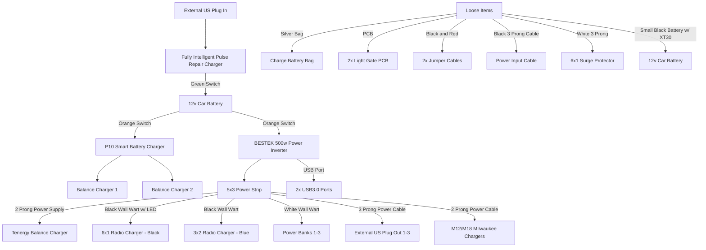

[](https://mermaid.live/edit#pako:eNqFVG1v2jAQ_iunfC4rSdRpotI-hNKKrahRQ9VJph88cgsRjhM5TgHV_e-7OAkUChQJOJ_vee7Fd_fmzPMYnYGTKF4sYHpzPZPQfp6iUFTJhAtko7VGJbkgHdRKGMsX6PV-wnDBVYKKUDtcq2O3lRAbstQoRJqg1BBWokR4xIKnqjNreMydQpQQrVI9XxhwvVdGXxhyBQHX5HzzsuejvrS4B8Vlgltg6PYZfSHKuNIddOvq-muCsXxFRSAWjKLp6Ddc9fsrCPMVqu3VfiS1t5oo4ILLObqsFTqn4H50e2DtfbL29tk7nxYURi67WvttOJFWaXHG2jxFAZkqbejVAuat6z__W9_qyoMkIrfBeBCqXCadi6ooxMZ00fpsihJVsoGDqE-QBYLPl_DMhaAfeo7VJdyPbgw88jjNXfZ97TbiNvkeWMhewU6QtSwe89feEZYKj8Zknhepxo8sNtGAyyVrUq7FEtyefyInf69AQ_5XoGkn5Razo7PyUOkzhN4xwkkqVrxaIrKJ611O3B87TZfmwQve53mJY41ZyawIVm6HK0rFq80tMS28nQzWnLaDQhYfi78jbXjCYWDgPk0W-o5rrFvKHqA-AV2ewzbvx2VM8x8b-FVlBSqbblkTNecm__Jrnu4Z2nrZ4o1lUWnWzSrJze05sqYdWjJD_U7FIFnjXOfKNqhVwVb3cpqLVg51VRNeV0_q-D9Tv2_qRdaV_NNecy6cDFXG05j28FvtYOboBWY4cwYkxlwtZ85MvpMdr3QebeTcGWhV4YVTFTGV_ibltL4zZ_CP0369cDBOKdRJs9jtfn__D0ur3bE)

