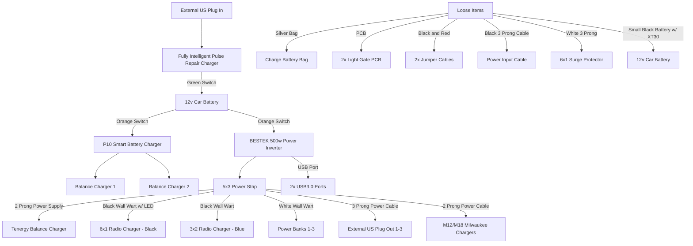

```mermaid
    graph TD;
        USPlugMale[External US Plug In] --> Charger;

        Charger[Fully Intelligent Pulse Repair Charger] --> |Green Switch| 12v[12v Car Battery];

        12v --> |Orange Switch| P10[P10 Smart Battery Charger];
        12v --> |Orange Switch| Inverter[BESTEK 500w Power Inverter];

        P10 --> Balance1[Balance Charger 1];
        P10 --> Balance2[Balance Charger 2];

        Inverter --> PS1[5x3 Power Strip];

        Inverter --> |USB Port| USB[2x USB3.0 Ports];

        PS1 --> |2 Prong Power Supply| Balance3[Tenergy Balance Charger];

        PS1 --> |Black Wall Wart w/ LED| Radio1[6x1 Radio Charger - Black];
        PS1 --> |Black Wall Wart| Radio2[3x2 Radio Charger - Blue];

        PS1 -->|White Wall Wart| PowerBank[Power Banks 1-3];

        PS1 --> |3 Prong Power Cable| USPlugFemale[External US Plug Out 1-3];

        PS1 --> |2 Prong Power Cable| Milwaukee[M12/M18 Milwaukee Chargers];

        LooseItems[Loose Items] --> |Silver Bag| ChargeBattery[Charge Battery Bag];
        LooseItems --> |PCB| LightGate[2x Light Gate PCB];
        LooseItems --> |Black and Red| JumperCables[2x Jumper Cables];
        LooseItems --> |Black 3 Prong Cable| PowerInput[Power Input Cable];
        LooseItems --> |White 3 Prong| SurgeProtector[6x1 Surge Protector]
        LooseItems --> |Small Black Battery w/ XT30| CarBattery[12v Car Battery];
```
